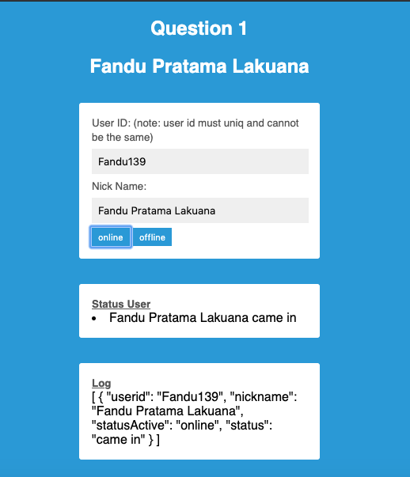
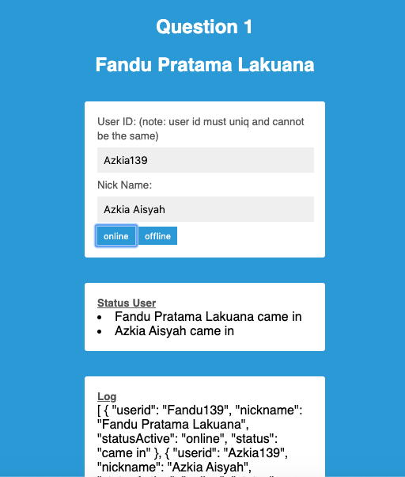
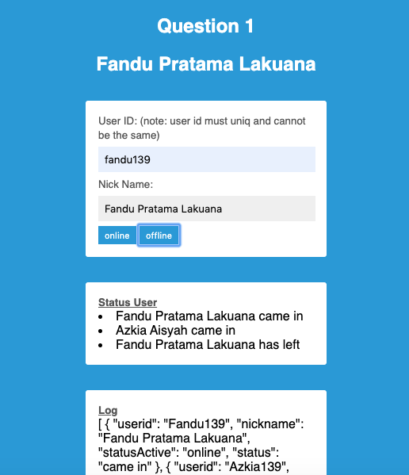
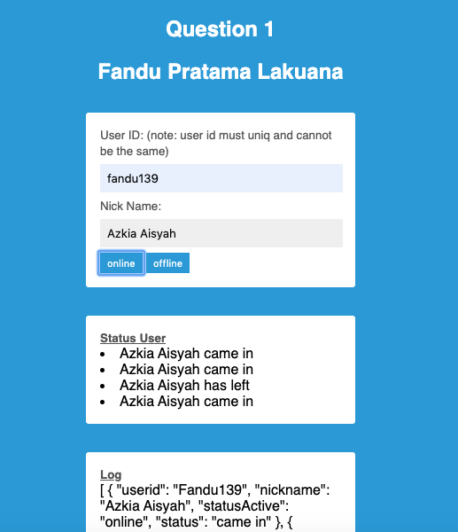
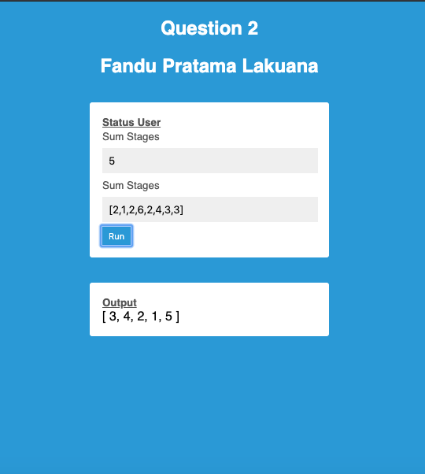

## How To Use Demo

#### Question 1

step 1 :
1. you can input User ID, example: Fandu139 (user must uniq)
2. then you input nick name, example: fandu pratama
3. and you click button `online`
4. now fandu139 online
5. and Log in Box `fandu pratama came in`

step 2 :
1. you must input User ID, example: Azkia139
2. and you input nick name, example: azkia aisyah
3. and then you click button `online` and now your status is online
4. and Log in Box `azkia aisyah came in`

step 3 :
1. you input User ID, example: Fandu139
2. then you input nick name, example: fandu pratama
3. and you click button `offline`
4. now `fandu pratama has left`

step 4 :
1. you input User ID, example: Fandu139 (user must uniq)
2. change name, example: from `fandu pratama` to `azkia aisyah`
3. and you click button `online`
4. must all in Box change to `Azkia Aisyah`

#### Question 2
step 1 :
1. you can input Sum Stages, example: 5
2. then you input Stages, example: `[2,1,2,6,2,4,3,3]`
3. and you click button `run`
4. and you can see `output` result `run` 

